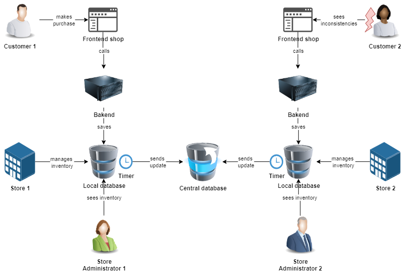
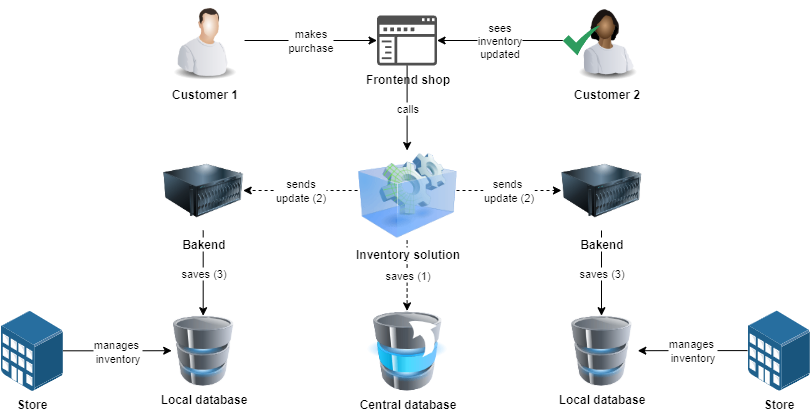
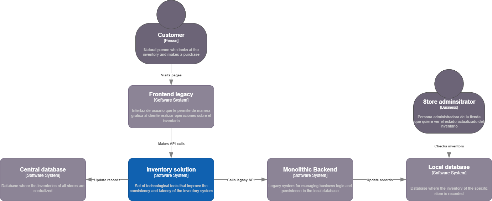
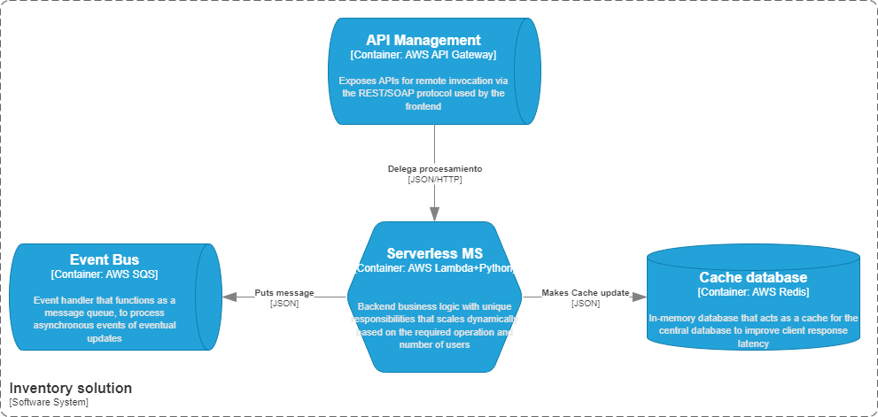
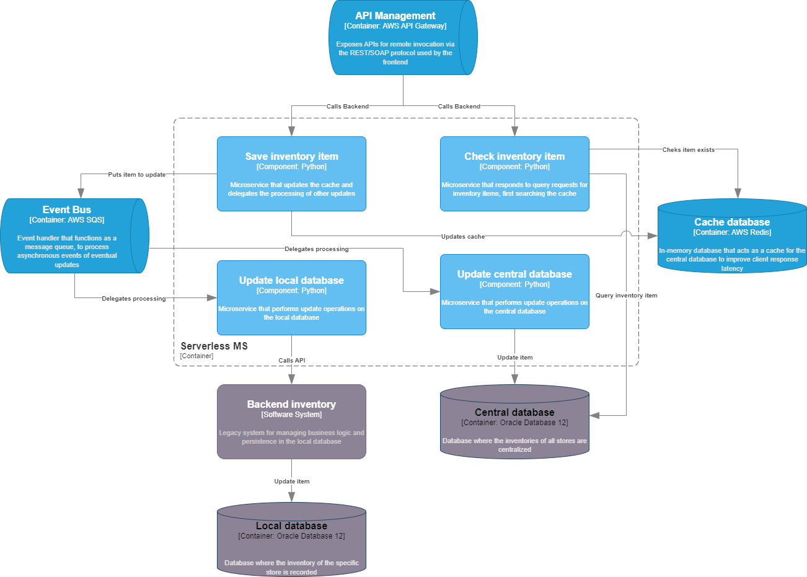
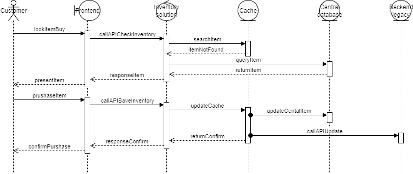

# Meli inventory solution
This is a software project to respond to Mercado Libre's AI Backend Developer challenge.

## Authors
- [@camiloninoj](https://github.com/camiloninoj)

## Desing
To prototype a technological solution that would improve the efficiency of the retail store's inventory management system, a solution architecture was designed to meet the most important objectives of consistency and latency. This was achieved through a methodological process explained below.

### Problem context


The first step is to diagram the current state of the system, where, according to the challenge statement, we can see the inconsistencies presented by concurrent users when querying different data sources, which take a long time to synchronize with the central database after the information flow has passed through all the system components.
At this point the following assumptions were made:

- The backend and frontend are decoupled components that communicate via APIs.
- Each store has its front and back distributed independently between the stores.
- Centralized database is important for business where consolidated data can be seen.
- There are no native replication mechanisms between local and central databases.
- The backend has other important responsibilities for the business that should not be changed.
- Local databases exist for store administration functions and must be maintained.
- There are no deployment infrastructure limitations so you can choose any cloud to host the solution.

### Solution context


The second step is to diagram the proposed solution, where we can see that a new component has been added to the system, which is responsible for managing the inventory of each store independently, allowing for efficient querying and updating of stock. This component communicates with the central database to ensure that the information is always up-to-date and consistent. Additionally, it synchronizes with the local database to ensure that all stores have access to the most recent information.

This solution was designed to impact existing systems as little as possible, but ensuring eventual consistency between all databases and the end user using the existing components, in addition to improving the latency of the processes of interaction with the inventory through purchases and item queries.

### C4 model diagram
To achieve the above objectives, the C4 diagramming model (Context, Containers, Components, and Code) is used to clarify the systems, components, and technologies involved in the solution. Starting from a general overview, the solution is increasingly detailed until a sequence diagram is reached that defines the flow of information between the components.

#### C4 Context
This diagram shows the users who interact with the entire inventory ecosystem and the subsystems involved in the entire process. It clarifies which elements are new (in blue) and which systems will not undergo drastic changes in their operation.



- **Customer**: The customer is the end user who interacts with the retail store's inventory system. They can browse products, check availability, and make purchases through the store's website or mobile app.
- **Frontend legacy**: The frontend legacy is the existing user interface of the retail store's inventory system. It is responsible for displaying product information, availability, and prices to customers. It will communicate with the new Inventory Solution to retrieve and update inventory data.
- **Inventory solution**: The inventory solution is a new component that manages the inventory of all stores. It provides APIs for querying and updating stock, ensuring that the information is always up-to-date and eventually consistent across all stores.
- **Central database**: The central database is the main repository of inventory data for the retail store. It stores information about products, stock levels, and transactions. The Inventory Solution will synchronize with this database to ensure that all stores have access to persisted information.
- **Monolithic Backend**: The monolithic backend is the existing backend system of the retail store. It handles various business logic and processes, including order processing, payment handling, and customer management. It will continue to operate as before, but will now interact with the Inventory Solution receiving inventory-related tasks.
- **Local database**: The local database is the existing database used by each store for administrative functions. It stores information about local inventory, sales, and other store-specific data. The Inventory Solution will synchronize with this database to ensure that each store has access to the most recent inventory information.
- **Store administrador**: Is the person that's access the local database to manage the store operations.

#### C4 Containers
The following diagram is an extension of the central system of the inventory solution, showing us the containers that intervene in the solution and their implementation technologies, these containers can encapsulate components inside them.



- **API Management**: is a managed service that acts as a single entry point for all client requests to the Inventory Solution. It handles request routing, authentication, and rate limiting. It exposes RESTful APIs for querying and updating inventory data. AWS API Gateway Managed Service is used for its high availability and scalability.
- **Servless MS**: is a serverless microservice that implements the business logic for managing inventory. It handles requests from the API Management, interacts with the databases, and ensures eventual consistency of inventory data. AWS Lambda is used for its ability to run code without provisioning or managing servers, allowing for automatic scaling based on demand.
- **Event bus**: is a managed service that facilitates asynchronous communication between different components of the Inventory Solution. It allows some Servless MS components to publish events when inventory will be updated in databases, which can then be consumed by other services or components. AWS SQS is used for its ability to integrate with various AWS services and third-party applications.
- **Cache database**: is a managed Redis cluster that serves as a high-speed distributed cache for frequently accessed inventory data. It helps reduce latency and improve the performance of inventory queries. AWS ElastiCache for Redis is used for its fully managed service that simplifies the deployment, operation, and scaling of Redis clusters.

##### Key decisions
At this point the following key design decisions become apparent:
- The "eventual consistency" pattern is used to replicate the change asynchronously between different persistent repositories without affecting the user experience who sees the change reflected immediately.
- Cross-cutting responsibilities are delegated to AWS managed services that guarantee dynamic scaling and high availability.
- Serverless technologies are used to ensure automatic scaling since the user load on the system is not predictable.
- Clean Architecture patterns such as hexagonal architecture are not used since the solution does not require much business logic that needs to be maintained over a long period of time, thus being more efficient in the maintenance process.
- The Python programming language is used in conjunction with AWS Lambdas for its fast startup times, ensuring smooth system scalability.
- To reduce operational costs resulting from major upgrades to current systems, the goal is to have a lesser impact on legacy systems.
- Aspects such as security or observability were not detailed and could be resolved with other managed solutions, however efforts were focused on ensuring consistency and latency
- It was decided to use services that bill on a pay-per-use basis, avoiding oversizing the infrastructure needed to provide the solution, anticipating cost savings due to idle resources.

#### C4 Components
The following diagram is an extension of the serverless microservice container, showing us the software components that intervene in the solution in an orchestrated manner, these components can encapsulate code inside them as functions following the principle of "single responsibility", which when distributed independently can scale more efficiently.


- **Chek inventory item**: is a function that handles requests to check the inventory of a specific item. It first checks the Cache Database for the item's availability. If the item is not found in the cache, it queries the Central Database, updates the cache with the retrieved information, and returns the result to the client.
- **Save inventory item**: is a function that handles requests to update the inventory of a specific item. It updates the Cache Database with the new quantity and publishes an event to the Event Bus to notify other components of the change.
- **Update central database**: is a function that listens for events from the Event Bus and updates the Central Database with the new inventory information.
- **Update local database**: is a function that listens for events from the Event Bus and updates the Local Database with the new inventory information.

#### C4 Code
The following diagram is a sequence diagram that shows the flow of information between the components of the Inventory Solution when a user checks or updates the inventory of an item. Some cross-cutting components have been omitted, abstracting their intervention in the current functionalities.

1. **Check Inventory Flow**:
    - The user interacts witch frontend system looking for an item to purchase.
    - The frontend system sends a request to the API to check the inventory of the specified item.
    - The "Check Inventory Item" function in Inventory Solutions first checks the Cache for the item.
    - If the item is found in the cache, it returns the result to the user.
    - If the item is not found in the cache, it queries the Central Database for the item.
    - The Central Database returns the item  to the "Check Inventory Item" function.
    - The "Check Inventory Item" function updates the Cache Database with the retrieved information and returns the result to the user.
    - The "Check Inventory Item" function response with the item information to the frontend system.
    - The frontend system displays the item information to the user.
2. **Update Inventory Flow**:
    - The user interacts witch frontend system to purchase an item.
    - The frontend system sends a request to the API to update the inventory of the specified item.
    - The "Save Inventory Item" function in Inventory Solutions updates the Cache Database with the new quantity.
    - The "Save Inventory Item" function publishes an event to the Event Bus to notify other components of the change.
    - The "Update Central Database" function listens for events from the Event Bus and updates the Central Database with the new inventory information.
    - The "Update Local Database" function listens for events from the Event Bus and updates the Local Database with the new inventory information.
    - The "Save Inventory Item" function responds with a success message to the frontend system.
    - The frontend system displays a success message to the user.

## Development
### Tech Stack
To implement the solution explained above, the following technologies have been chosen

- **Intraestructure:** AWS, IaC Terraform
- **Backend:** Python

The development process was relatively fast given the high level of detail in the design and the use of Github Copilot integrated into the IntelliJ community IDE.

### Project structure
A Monorepo project structure was chosen where the artifacts of the entire solution could be organized, including infrastructure such as code, solution logic, documentation, and auxiliary artifacts such as development prompts.
```
meli-inventory-solution/
│
├── apps/
│   ├── check-inventory-item/
│   │   └── main.py
│   ├── save-inventory-item/
│   │   └── main.py
│   ├── update-central-db/
│   │   └── main.py
│   └── update-local-db/
│       └── main.py
│
├── docs/
│   ├── Inventory-C4-Components.drawio.xml
│   ├── Inventory-C4-Containers.drawio.xml
│   └── prompt.md
│
├── infrastructure/
│   ├── modules/
│   │   ├── api-gateway/
│   │   │   └── main.tf
│   │   ├── cache/
│   │   │   └── main.tf
│   │   ├── event-bus/
│   │   │   └── main.tf
│   │   └── lambda/
│   │       ├── main.tf
│   │       └── outputs.tf
│   ├── main.tf
│   ├── swagger.yaml
│   └── variables.tf
│
├── huvalidation-pompts-history.md
├── README.md
└── run.md
```
### Generating the code
To generate the code for the entire solution, including the code contained within this readme file, interactive prompts were used with the agent and the editing functionality of the Copilot plugin in the IDE. However, due to the free license's limitation on saving the history of all interactions, details of the prompts used could not be retrieved.

However, some examples of a prompt used to generate the code for the project is included below:
```
Dado el archivo adjunto xml de draw.io que contiene el diagrama de componentes C4 de una solucion serverless en AWS, genera el codigo en python para una lambda de AWS que implemente la funcionalidad de consultar el inventario de un item especifico, siguiendo las buenas practicas de desarrollo y utilizando las librerias mas comunes para este proposito.
```
```
Dado el archivo adjunto swagger.yaml que contiene la especificacion de una API RESTful, genera el codigo en python para una lambda de AWS que implemente la funcionalidad de consultar el inventario de un item especifico, siguiendo las buenas practicas de desarrollo y utilizando las librerias mas comunes para este proposito.
```
```
Genera el arbol de carpetas del proyecto actual en un formato grafico que se pueda mostrar dentro del archivo readme
```

In addition, there is the huvalidation-pompts.md file, used in the generation of other software development projects oriented to writing software code based on user stories that came to be considered for this project.

The code generated by Copilot is consistent with the proposed components, technologies, design patterns, and project organization. However, given time and cost constraints, and the inability to connect to an AWS account, this solution has not been tested in a real-world environment.

## API Documentation - Inventory System

###  Overview
This API allows you to manage product inventory, enabling querying and updating stock of specific items.

###  Base URL
The API is deployed on AWS API Gateway. The base URL will be provided by the system administrator.

###  Endpoints

####  1. Check Inventory
Retrieves inventory information for a specific item.

- **Endpoint:** `/inventory/{itemId}`
- **Method:** GET
- **URL Parameters:**
    - `itemId` (required): Unique item identifier

##### Responses
- **200 OK**: Item found
  ```json
  {
    "itemId": "string",
    "quantity": 0,
    "lastUpdate": "2025-09-27T10:00:00Z"
  }
  ```
- **404 Not Found**: Item not found

#### 2. Update Inventory
Updates the inventory quantity for a specific item.

- **Endpoint:** `/inventory/{itemId}`
- **Method:** PUT
- **URL Parameters:**
    - `itemId` (required): Unique item identifier
- **Body:**
  ```json
  {
    "quantity": 0
  }
  ```

##### Responses
- **200 OK**: Inventory updated successfully
- **400 Bad Request**: Invalid input

### Data Models

#### InventoryResponse
```json
{
  "itemId": "string",
  "quantity": 0,
  "lastUpdate": "2025-09-27T10:00:00Z"
}
```

#### InventoryUpdate
```json
{
  "quantity": 0
}
```

### Considerations
- All requests must include the header `Content-Type: application/json`
- Dates are handled in ISO 8601 format
- The quantity must be a positive integer

### Security
The API is protected by AWS IAM. Appropriate credentials are required to make requests.

### Usage Examples

#### Check inventory
```bash
curl -X GET https://[API_URL]/inventory/ITEM123
```

### Update inventory
```bash
curl -X PUT https://[API_URL]/inventory/ITEM123 \
     -H "Content-Type: application/json" \
     -d '{"quantity": 100}'
```
